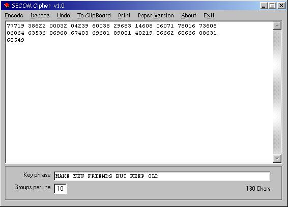



## SECOM field cipher

### Description

This Encryption tool provides a fast way to encipher messages with the SECOM handcipher. SECOM uses a 20 letter key phrase to generate the settings for a straddling checkerboard, a normal and a disrupted transposition. The combination of fractioning by the checkerboard and the double disrupted transposition makes SECOM a higly secure encryption methode. Although the program will encode or decode a message very fast, the main purpose of SECOM is secure manual pencil-and paper encryption. In the program, you can call the paper version of SECOM and learn with clear instructions how to use this handcipher 'in the field'. This program is an educational interesting example of classic cryptography, more specific disrupted transpositions and fractionation of text. *** update 9/18 W1 W2 calculation error ***
 
### More Info
 

             |
---                |---
**Submitted On**   |2005-09-18 18:17:08
**By**             |[D\. Rijmenants](https://github.com/Planet-Source-Code/PSCIndex/blob/master/ByAuthor/d-rijmenants.md)
**Level**          |Intermediate
**User Rating**    |5.0 (10 globes from 2 users)
**Compatibility**  |VB 5\.0, VB 6\.0
**Category**       |[Encryption](https://github.com/Planet-Source-Code/PSCIndex/blob/master/ByCategory/encryption__1-48.md)
**World**          |[Visual Basic](https://github.com/Planet-Source-Code/PSCIndex/blob/master/ByWorld/visual-basic.md)
**Archive File**   |[SECOM\_fiel1933569182005\.zip](https://github.com/Planet-Source-Code/d-rijmenants-secom-field-cipher__1-62602/archive/master.zip)

